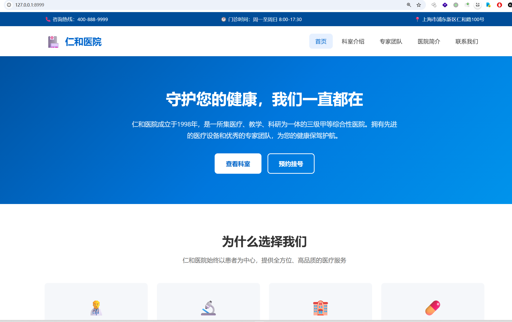

# 仁和医院 CTF 靶场

基于 Golang 的医院门户网站 Web 靶场，用于 CTF 目录扫描类题目。



## 题目描述

参赛者访问一家仿真的医院门户网站，通过信息收集（查看源码、控制台、robots.txt、目录扫描）发现隐藏的源码备份文件，下载解压后获取 flag。

## 快速启动

```bash
# 构建
go build -o trap .

# 运行（默认端口 8999）
./trap

# 自定义监听端口
PORT=9090 ./trap
```

注意：本程序build时并未打包./backup目录（仅打包了html和样式文件等），所以可执行程序的目录下必须有./backup及flag压缩包，否则参赛者下载不到  http://127.0.0.1:8999/backup/wwwroot.zip 。

当前项目中的 ./backup/wwwroot.zip 已经在仓库文件里，直接git clone下来就可以开始测试了。

## Hint 线索

做题人可以通过以下途径发现备份文件：

| 途径 | 说明 |
|------|------|
| 查看页面源码 | footer 中有 hidden 元素提示 backup 路径 |
| robots.txt | Disallow: /backup/ 暴露备份目录 |
| 浏览器控制台 | console.log 输出 dev hint |
| main.js 源码 | 注释和变量中包含 backupFile 信息 |

## 压缩包要求

- **文件名**：`wwwroot.zip`
- **放置路径**：`backup/wwwroot.zip`（即项目根目录下的 `backup/` 子目录）
- **URL**：`http://<host>:8999/backup/wwwroot.zip`
- **内容**：自由发挥，flag 放在解压后的任意文件中

### 制作示例

放置flag压缩包到 ./backup 下，命名为 wwwroot.zip。

---

